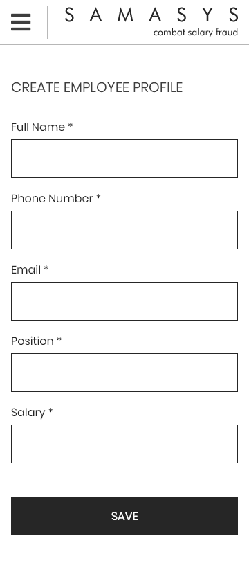
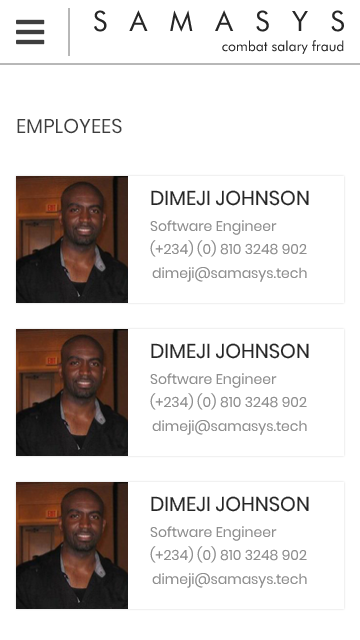
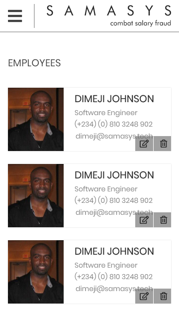
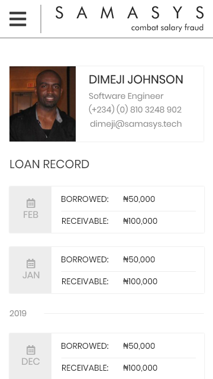

# Employee Management Flutter APP
All the 3 tasks are implemented in this project.

## Tasks Background

For the tasks below, I assume that the end user is already logged in and has the required permissions to view the screens or carry out the operations below. In this case, the end user is the admin.

All the data is saved in locally in mobile device.

## Task 1

On this screen the user is able to do the following:

- Create the employee profile
- Get **timely** feedback on wrong inputs
- Move the user to the employees listing page after the creation is successful

## Task 2

Hovering on each of the employee listed above, gives the following screen below:

The user can do the following on this page:

- Delete the employee
- Clicking the edit button shows an error with a message indicating that the feature is not available at the moment.

## Task 3 (Bonus)

Admin able to see the full details of the employee when we click on each of the employee's name or image in the EmployeesPage above. This should take us to the page below:

On this page, the user is only able to view the data. Right now this screen's loan data is static.
